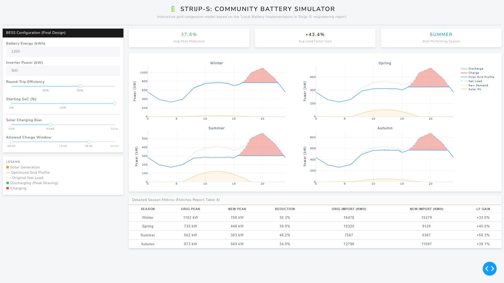

# 🔋 Strijp-S Grid Congestion Solver

An interactive simulation tool designed to model a **1.2 MWh Community Battery Energy Storage System (BESS)** for the Strijp-S district in Eindhoven.

This project translates the analytical findings of our engineering report, *"Local Battery Implementation in Strijp-S,"* into a dynamic Python application. It allows stakeholders to visualize peak-shaving potential across different seasons.

## 🏙️ Project Context
The Strijp-S neighborhood faces significant grid congestion due to the mismatch between:
*   **High Solar Generation:** Midday peaks (up to ~943 kWh in summer).
*   **Evening Demand:** Residential/EV peaks (up to ~1070 kW in winter).

Traditional grid reinforcement is costly. This simulation proves that a **Lithium Iron Phosphate (LFP)** battery can mitigate these peaks without infrastructure upgrades.

## 🛠️ How It Works
The app uses a custom **Binary Search algorithm** combined with a **Water-Filling charging strategy** to optimize the battery schedule.

**Key Parameters (Matches Final Design):**
*   **Capacity:** 1.2 MWh
*   **Inverter:** 500 kW
*   **Efficiency:** 90%
*   **Logic:** Peak Shaving + Solar Self-Consumption

## 📊 Results
As detailed in the final report, this logic demonstrates:
1.  **Peak Reduction:** ~31.6% decrease in grid peak power.
2.  **Load Factor Improvement:** Increases from 0.55 to 0.8.
3.  **Grid Stability:** Prevents transformer overloading during solar peaks.

## 💻 Installation
To run this dashboard locally:

1. Clone this repository.
2. Install dependencies:
   ```bash
   pip install -r requirements.txt
